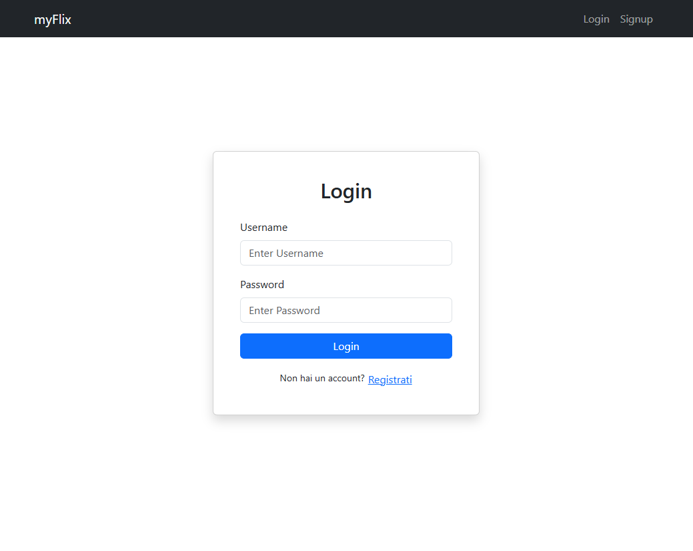
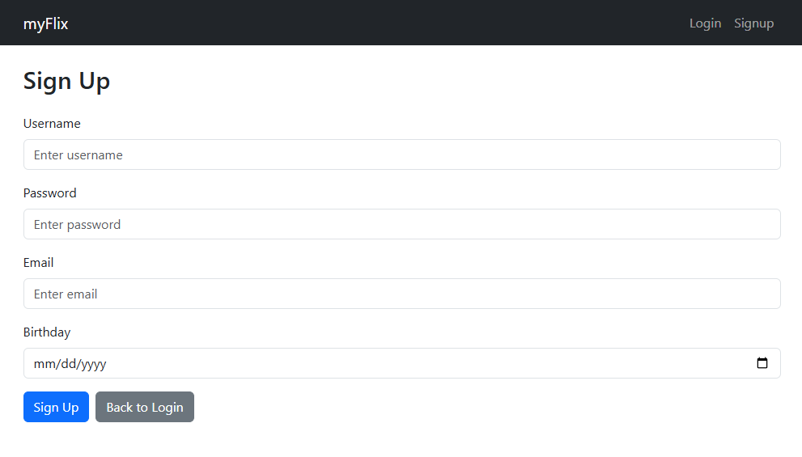
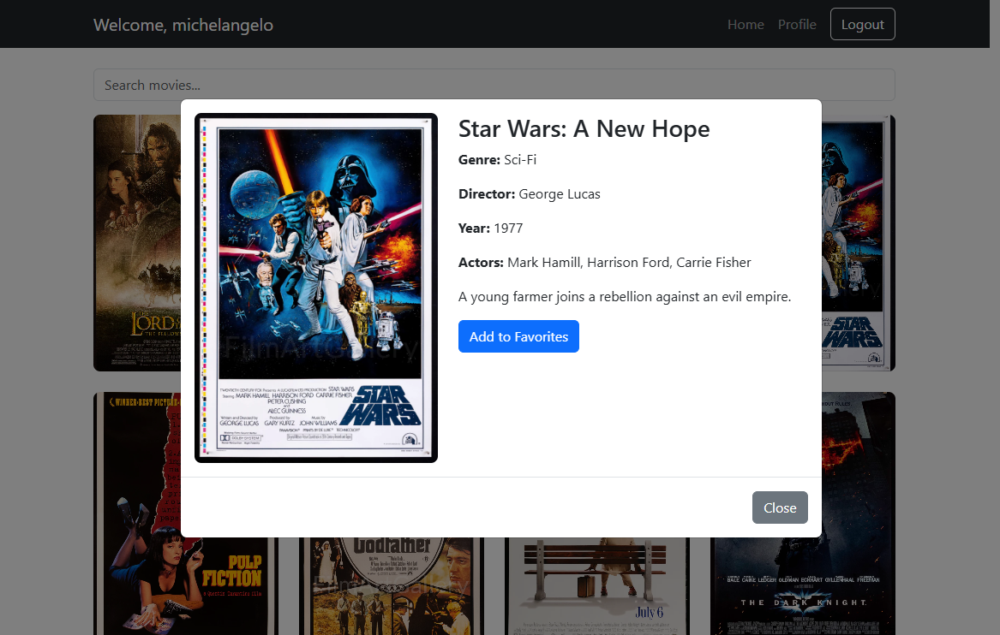
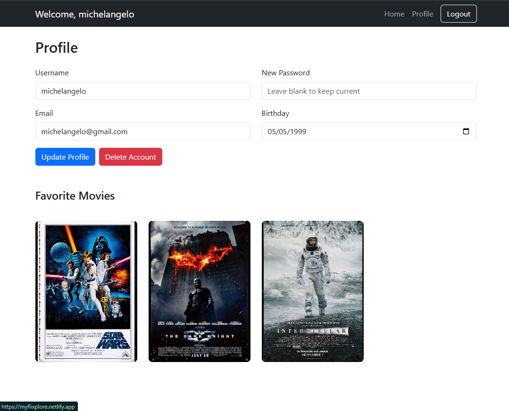

# myFlix-client

myFlix-client is the frontend application of the myFlix API
project, built with React. It allows users to browse a collection of movies, view detailed information, manage their profiles, and maintain a list of favorite films. The app communicates with a RESTful API built with Node.js, Express, and MongoDB.

This project represents the final frontend version of myFlix and is fully functional.

---

### Project Context (Achievement 3 – CareerFoundry)

The goal of this Achievement was to build the client-side for myFlix based on its existing server-side code. Users (movie enthusiasts) should be able to:

- Access detailed movie, genre, and director information
- Register and authenticate via JWT
- Save and manage a list of favorite movies
- Update personal information or delete their account
- The frontend is a single-page application (SPA) with routing, rich interactions, and a polished user experience. It integrates with the backend endpoints previously developed and tested in Postman.

Key Technical Points:

- Built with React (ES6+), using functional components
- React Router for SPA navigation
- React Bootstrap for responsive design and layout
- Communicates with backend via REST API
- State management handled via React hooks
- Hosted online (Netlify)

---

## Features

- Browse and search movies in real-time
- View detailed information about each movie
- Add/remove movies from personal favorites
- User authentication with JWT (login/signup)
- Update user profile and delete account
- Responsive design with React Bootstrap
- SPA navigation via React Router
- Optional: view genre and director information

---

## Build Tools

- **React** for building UI components
- **React Router DOM** for navigation
- **React Bootstrap** for styling and layout
- **Parcel** for bundling and building the client-side code

---

### Backend Integration

The frontend interacts with the myFlix API hosted on Render:

Base URL: https://myflix-api-0vxe.onrender.com

Key Endpoints:

Method Endpoint Description Auth

POST /users Register new user No
POST /login Login and get JWT No
GET /movies List all movies Yes (temporarily public)
GET /movies/:title Get movie details Yes
GET /genres/:name Get genre info Yes
GET /directors/:name Get director info Yes
POST /users/:Username/movies/:MovieID Add to favorites Yes
DELETE /users/:Username/movies/:MovieID Remove from favorites Yes
PUT /users/:Username Update user info Yes
DELETE /users/:Username Delete account Yes

All endpoints have been tested in Postman. Passwords are hashed with bcrypt. JWT required for protected routes.

---

## Installation

# 1 Clone this repository:

    git clone https://github.com/your-username/myFlix-client.git

# 2 Install dependencies:

    npm install

# 3 Start the development server:

    npm start

## Live Demo

Check out the live version of **myFlix-client** here: [https://myflixplore.netlify.app](https://myflixplore.netlify.app)

---

## Reflections

# Role & Tasks:

Developed the full frontend in React, integrated JWT authentication, implemented search/filter logic, and styled the app with React Bootstrap.

# Decisions & Consequences:

- React Router for SPA navigation ensures smooth user experience
- React Bootstrap improves maintainability and responsiveness
- Functional components with hooks keep state management simple and safe

# Lessons Learned:

- Client-side routing and state management in React
- Handling API requests and error responses
- Implementing secure authentication and protected routes

# Future Improvements:

- Pagination and advanced search (filter by genre, release year)
- Unit testing for components
- Additional optional views (actors, “To Watch” list, similar movies)

# Screenshot

**Login / Signup**

**Sign Up**

**Single Movie View**

**Profile View**

